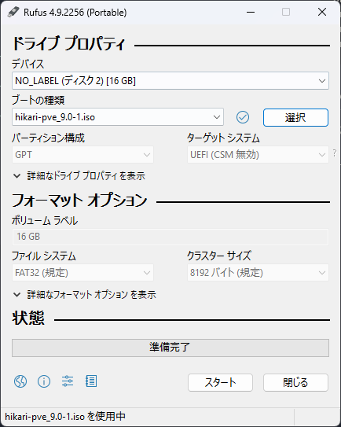

# Proxmox VEの自動インストール

Proxmox VEには自動インストール機能があります．
インストーラと対話して手動で設定をするアレを，応答ファイルによって自動化できます．

筆者はWindows 11ユーザなので，WSL2上で作業していきます．

## Proxmox VEインストーラのダウンロード

ここでは`Proxmox VE 9.0 ISO Installer`を使用します．

```shell
wget -P images https://enterprise.proxmox.com/iso/proxmox-ve_9.0-1.iso
```

[ここ](https://www.proxmox.com/en/downloads/proxmox-virtual-environment/iso)からもダウンロードできます．

## 自動インストール用ISOイメージの作成

ISOイメージ作成ツールとして`proxmox-auto-install-assistant`を使用します．
権限がないよ！と言われたりしたら，適宜`sudo`してください．

```shell
apt update
apt install -y wget xorriso
wget http://download.proxmox.com/debian/pve/dists/bookworm/pve-no-subscription/binary-amd64/proxmox-auto-install-assistant_8.4.6_amd64.deb -O proxmox-auto-install-assistant.deb
dpkg -i proxmox-auto-install-assistant.deb
```

Dockerが使える方は，以下のコマンドでも同じことができます．

```shell
docker build -t proxmox-auto-install .
docker run --rm -it -v ./:/workspace proxmox-auto-install
```

---

各PVEノードISOイメージを作成します．

```shell
proxmox-auto-install-assistant prepare-iso images/proxmox-ve_9.0-1.iso --fetch-from iso --answer-file answers/hikari-answer.toml --output dist/hikari-pve_9.0-1.iso
proxmox-auto-install-assistant prepare-iso images/proxmox-ve_9.0-1.iso --fetch-from iso --answer-file answers/tairitsu-answer.toml --output dist/tairitsu-pve_9.0-1.iso
proxmox-auto-install-assistant prepare-iso images/proxmox-ve_9.0-1.iso --fetch-from iso --answer-file answers/nonoka-answer.toml --output dist/nonoka-pve_9.0-1.iso
```

## インストールメディアの作成

ここでは`rufus-4.9p`を使用します．
rufusは[ここ](https://rufus.ie/ja/)からダウンロードできます．

先程作成したISOイメージを選択します．



WSL2上で作業した方は，エクスプローラからWSL2にアクセスしてください．
アドレスバーに`\\wsl$`を入力するといいかもしれません．

スタートを押すと，インストールメディアの作成が始まります．

## （オプション）Linuxカーネルパラメータを編集する場合

Linuxカーネルパラメータを編集する必要がある場合は，もうひと手間必要です．
ここではPVEノード`nonoka`用に設定を変更します．
`nonoka`が搭載しているハードウェアRAID`PRAID CP400i`を使用するには，PCIパススルーを設定する必要があるからです．

ISOイメージをゴニョゴニョすれば設定できると思われるので，これも自動化したかったのですが...
技術的な面でわからないことが多いので，この場合のみ手動で設定することにします．
（ISOイメージの中身をコピー，`/boot/grub/grub.cfg`を編集し，ISOイメージを再構成すればできるような気がする．）

Linuxカーネルパラメータを手動で編集する方法は，[この記事](https://k4u.jp/blog/solve-l2-l3-cache-error/)を参照してください．

## 参考文献

- [Automated Installation - Proxmox VE](https://pve.proxmox.com/wiki/Automated_Installation)
