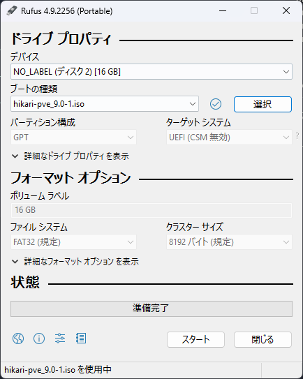

# Proxmox VEの自動インストール

Proxmox VEには自動インストール機能があります[^1]．
インストーラと対話して手動で設定をするアレを，応答ファイルによって自動化できます．

筆者はWindows 11ユーザなので，WSL2上で作業していきます．

## Proxmox VEインストーラのダウンロード

ここでは`Proxmox VE 9.0 ISO Installer`を使用します（2025-08-26T00:00:00+0900 時点で最新です）．
以下のコマンドを実行してください．

```shell
wget -P images https://enterprise.proxmox.com/iso/proxmox-ve_9.0-1.iso
```

[ここ](https://www.proxmox.com/en/downloads/proxmox-virtual-environment/iso)からもダウンロードできます．

## 自動インストール用isoイメージの作成

ISO作成ツールとして`proxmox-auto-install-assistant`があります[^2]．
ツールを使用できるようにするため，以下のコマンドを実行してください．
権限がないよ！と言われたりしたら，適宜`sudo`してください．

```shell
apt update
apt install -y wget xorriso
wget http://download.proxmox.com/debian/pve/dists/bookworm/pve-no-subscription/binary-amd64/proxmox-auto-install-assistant_8.4.6_amd64.deb -O proxmox-auto-install-assistant.deb
dpkg -i proxmox-auto-install-assistant.deb
```

Dockerが使える方は，以下のコマンドでも同じことができます．

```shell
docker build -t proxmox-auto-install .
docker run --rm -it -v ./:/workspace proxmox-auto-install
```

---

各PVEノード用にisoイメージを作成します．
以下のコマンドを実行してください．

```shell
proxmox-auto-install-assistant prepare-iso images/proxmox-ve_9.0-1.iso --fetch-from iso --answer-file answers/hikari-answer.toml --output dist/hikari-pve_9.0-1.iso
proxmox-auto-install-assistant prepare-iso images/proxmox-ve_9.0-1.iso --fetch-from iso --answer-file answers/tairitsu-answer.toml --output dist/tairitsu-pve_9.0-1.iso
proxmox-auto-install-assistant prepare-iso images/proxmox-ve_9.0-1.iso --fetch-from iso --answer-file answers/nonoka-answer.toml --output dist/nonoka-pve_9.0-1.iso
```

## インストールメディアの作成

インストールメディアを作成します．
ここでは`rufus-4.9p`を使用します．
rufusは[ここ](https://rufus.ie/ja/)からダウンロードできます．

インストールメディアにするデバイスと，先程作成したisoイメージを選択してください．
ここでは，16GBのUSBメモリに，PVEノード`hikari`用のisoイメージを書き込みます．



WSL2上で作業した方は，エクスプローラからWSL2にアクセスしてください．
アドレスバーに`\\wsl$`を入力するといいかもしれません．

スタートを押すと，インストールメディアの作成が始まります．

## 備考

[^1]: Proxmox VE 8.2から，自動インストールがサポートされるようになりました．

[^2]: Proxmoxの無償版リポジトリにあります．
